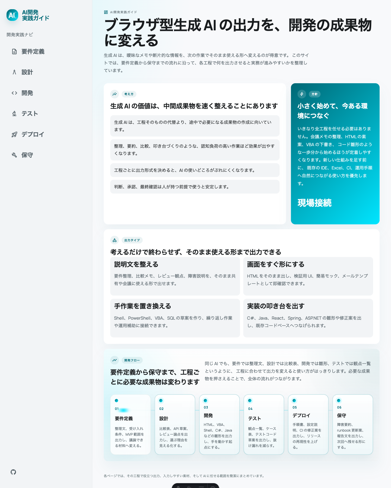

# AI開発実践ガイド

ブラウザで使える生成 AI を前提に、要件定義、設計、開発、テスト、デプロイ、保守での実務的な使い方を整理した Astro ベースの静的サイトです。



## サイト概要

- ブラウザ型生成 AI を、実務の各工程でどう使うかを整理しています
- 各ページは `工程の論点`、`Prompt 設計`、`ケース分析` の 3 区で構成しています
- `ケース分析` では、実際の prompt と ChatGPT の返答イメージを並べて確認できます

## ページ構成

- `要件定義`: 断片的な情報を、合意に使える要件文へ整理する
- `設計`: 比較表、レビュー論点、モックを通じて選ぶ理由を明確にする
- `開発`: HTML、スクリプト、アプリコードの叩き台を素早く作る
- `テスト`: 観点整理、ケース洗い出し、抜け漏れの低減に使う
- `デプロイ`: 手順、設定、CI の修正案を言語化して再現性を上げる
- `保守`: 障害整理、共有文、次の確認ポイントを素早くまとめる

## ローカル開発

```bash
npm install
npm run dev
```

ブラウザで [http://localhost:4321](http://localhost:4321) を開くと確認できます。

## ビルド

```bash
npm run build
npm run preview
```

## プレビュー設定

各子ページの `ケース分析` に出る ChatGPT 共有プレビューは、次の設定ファイルにまとめています。

- [src/data/caseStudyPreviewConfig.ts](/Users/kejincai/dev/stitch_ai_homepage/src/data/caseStudyPreviewConfig.ts)

今は 6 ページ分とも placeholder を入れてあり、後で `previewHref` を差し替えるだけで更新できます。  
OG 画像はコンポーネント側で自動的に解決します。

## デプロイ

GitHub Pages を使う場合は、`Settings > Pages` で `GitHub Actions` を選び、`main` に push します。

## リポジトリ

- [GitHub](https://github.com/kekincai/ai_homepage)
